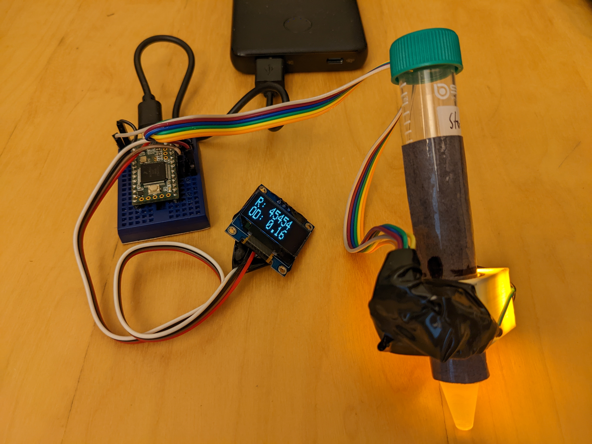
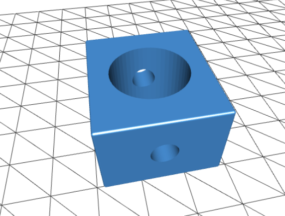
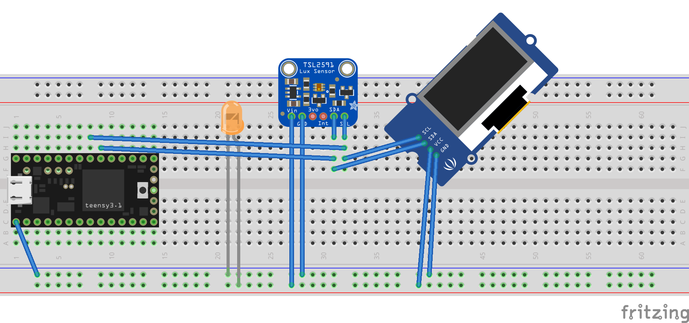

# OD600 spectrometer for enrichment and culture growth measurement

We've developed this minimal device for monitoring growth of liquid cultures in tubes. Optical density at a wavelength of 600nm, or _OD600_, is a common tool for measuring relative microbial growth in (semi-)transparent liquid media. It is based on light scattering (more than absorbance) by cells in the  orange-yellow range. While there is variance for different organisms and different instruments, it is a simple noninvasive method to rapidly measure culture growth over time. 

Thanks to improvements in LED effeciency and light sensors, this minimal design is accurate enough for field growth of small volumes liquid culture in 15ml centerfuge tubes. 

__Coming soon: spectral measurements and comparisons of mixed communities and diverse isolates VS lab-grade equipment__

## Design

### Prototype:

### 3d printed part:

Parametric script in [OpenSCAD](https://openscad.org/): [OD600_15mlFalcon.scad](OD600_15mlFalcon.scad)

Render in stl format: [OD600_15mlFalcon.stl](OD600_15mlFalcon.stl)

### Circuit:

### Code:
here: [OD600.ino](OD600.ino)

Code adapted from the excellent [Adafruit_TSL2591](https://github.com/adafruit/Adafruit_TSL2591_Library/blob/master/examples/tsl2591/tsl2591.ino) and [OLED](https://learn.adafruit.com/monochrome-oled-breakouts/arduino-library-and-examples) examples. 

## Overview

__Cost:__ ~30$ (as of 2022) per unit, <$50 to make just one including shipping

__Material lead time:__ Several weeks for the cheapest sources and shipping costs 

__Time:__ An hour to a day, depending on skill level

__Tools:__ Soldering, wire crimping, or breadboard, access to a 3d printer (or double the cost and order a print).  

__Skills:__ Simple electronics wiring, load code into an Arduino-compatible microcontroller, ability to outsource or FDM 3d print a model 

This simple design doesn't take much background to make. Ask around at your local Makerspace, library, or engineering department if you don't yet have these abilities yourself, there are a entire communities of people out there who are interested in sharing these skills. 

This design is similar to others also developed around near-monochromatic LEDs and the TSL2591 light sensor.  This article is a great starting place that we have expanded for our needs. 

https://www.nutsvolts.com/magazine/article/diy-biotech-a-spectrophotometer-for-measuring-bacterial-growth

## Parts 

- [Teensey 3.2](https://www.pjrc.com/store/teensy32_pins.html) or similar capability Arduino (need 2 I2C pins, 3V and (optionally 5V)
- USB cable and power supply (wall transformer or powerbank)
- [OLED display](https://www.adafruit.com/product/4440) ssd1306_128x32_or similar i2c display
- [TSL2591](https://www.adafruit.com/product/1980) High Dynamic Range Digital Light Sensor
- [LED](https://smile.amazon.com/dp/B093DDKCMC) approx 600nm, we have used both through hole and high power yellow 588 to 590nm LED 1W 5V LED 200lm with a heatsink. You can run these at 3V at reduced brightness. 
- 4 small M4 bolts
- Black cardboard or construction paper

## Build instructions

Preparation

1. Order / collect parts
2. Set up computer with [Arduino IDE](https://www.arduino.cc/en/Guide/) and 3d slicer and control software (see [arduino_install.sh](arduino_install.sh) for an example. Install all needed boards and both the the Adafruit_TSL2591 library and adafruit_GFX library. 
3. 3d print (or order) the part(s) found here: [OD600_15mlFalcon.stl](OD600_15mlFalcon.stl)

Assembly

4. Use breadboard or crimp cables or soldering to make circuit. 
5. Use Arduino IDE to load program into Arduino
6. Assemble LED and sensor on opposite sides of the 3d part with screws. 
7. Cut and tape the black paper into a cylinder that just fits around your 15ml tube. Remove and and use a holepunch to make hole you can align inside the 3d part between the LED and sensor. 

Use

8. Plug in the Arduino to USB power. Insert blank for zeropoint, insert cultures for OD600 measurements.

### Improvements currently in development

- Calibration to zero and max absorbance, recording blanking values
- Automated and manual sensitivity ranging (LED PWM, acquisition time)
- Trigger USB keyboard emulated typing of the OD with a button press (when plugged into a laptop, for automated transcribing of values).
- Multi-tube swappable size adapters 
- 3d printed case

